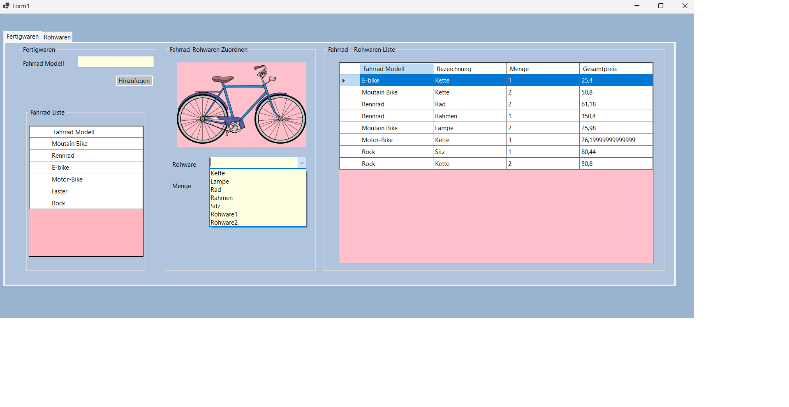
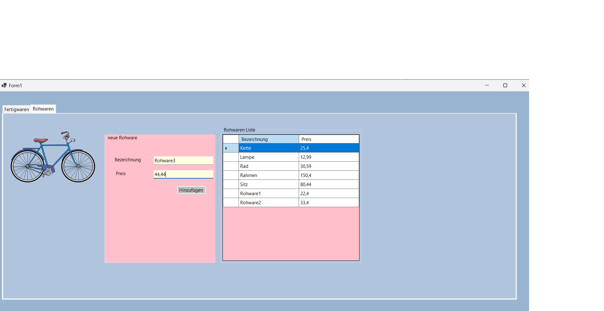

# Fahrradverwaltung 

Eine C# Windows Forms Anwendung zur Verwaltung von Fahrrädern, deren Komponenten und Materialien mit MySQL-Datenbankanbindung.

## Beschreibung

Das Fahrradverwaltungssystem ermöglicht es Ihnen:
- **Fertigwaren (Fahrradmodelle)** zu verwalten
- **Rohstoffe/Komponenten** (Ketten, Räder, Rahmen, etc.) zu verwalten
- **Zuordnungen** zwischen Fahrradmodellen und benötigten Komponenten zu erstellen
- **Preisberechnungen** für Fahrradmodelle basierend auf den verwendeten Komponenten
- **Übersichtliche Darstellung** aller Daten in DataGridView-Komponenten

## Technologie-Stack

- **Framework**: .NET 8.0 Windows Forms
- **Programmiersprache**: C#
- **Datenbank**: MySQL/MariaDB
- **IDE**: Visual Studio

## Datenbankstruktur

Das System verwendet eine MySQL-Datenbank mit folgenden Tabellen:

### Tabellen:
- **`fertigwaren`** - Speichert Fahrradmodelle
  - `fwnr` (Primary Key)
  - `fwmodell` (Modellname)

- **`rohstoffe`** - Speichert Komponenten/Materialien
  - `rsnr` (Primary Key)
  - `preis` (Preis der Komponente)
  - `bezeichnung` (Name der Komponente)

- **`fwrs`** - Verknüpfungstabelle (Fertigwaren-Rohstoffe)
  - `fwrsnummer` (Primary Key)
  - `fwnr` (Foreign Key zu fertigwaren)
  - `rsnr` (Foreign Key zu rohstoffe)
  - `rohwarenAnzahl` (Benötigte Anzahl)

### View:
- **`vfertigwaren_details`** - Zeigt detaillierte Informationen mit Preisberechnung

## Installation und Setup

### Voraussetzungen:
- .NET 8.0 SDK oder höher
- MySQL/MariaDB Server
- Visual Studio 2022 oder höher

### Schritt-für-Schritt Installation:

1. **Repository klonen**
   ```bash
   git clone [repository-url]
   cd fahrradverwaltung
   ```

2. **Datenbank einrichten**
   - MySQL/MariaDB Server starten
   - Datenbank erstellen:
     ```sql
     CREATE DATABASE fahrradverwaltung;
     ```
   - SQL-Datei importieren:
     ```bash
     mysql -u root -p fahrradverwaltung < fahrradverwaltung.sql
     ```

3. **Datenbankverbindung konfigurieren**
   - Öffnen Sie `Datenbank.cs`
   - Passen Sie die Verbindungszeichenfolge an:
     ```csharp
     private string connstr = "SERVER=localhost; UID='root';PASSWORD='IhrPasswort';DATABASE=fahrradverwaltung";
     ```

4. **Projekt kompilieren und ausführen**
   
   **Option A: Mit .NET CLI (Command Line)**
   ```bash
   dotnet restore    # Lädt alle NuGet-Pakete herunter
   dotnet build      # Kompiliert das Projekt
   dotnet run        # Startet die Anwendung
   ```
   
   **Option B: Mit Visual Studio (Empfohlen für Windows Forms)**
   - Öffnen Sie `fahrradverwaltung.sln` in Visual Studio
   - Drücken Sie `F5` oder klicken Sie auf "Starten"
   - Visual Studio führt automatisch Build und Start aus

## Verwendung

#### 1. Fertigwaren (Fahrradmodelle) verwalten
- **Hinzufügen**: Neues Fahrradmodell über Textfeld eingeben und "Hinzufügen" klicken
- **Anzeigen**: Alle Modelle werden in der linken DataGridView angezeigt

#### 2. Rohstoffe (Komponenten) verwalten
- **Hinzufügen**: Bezeichnung und Preis eingeben, dann "Hinzufügen" klicken
- **Anzeigen**: Alle Komponenten werden in der rechten DataGridView angezeigt

#### 3. Komponenten zu Fahrradmodellen zuordnen
- Fahrradmodell aus der Liste auswählen
- Komponente aus der Dropdown-Liste auswählen
- Anzahl der benötigten Komponenten eingeben
- "Zuordnen" klicken

#### 4. Detailansicht
- Die untere DataGridView zeigt alle Zuordnungen mit automatischer Preisberechnung
- Zeigt: Fahrradmodell, Komponente, Anzahl, Gesamtpreis

## Fehlerbehebung

### Häufige Probleme:

1. **Datenbankverbindung fehlgeschlagen**
   - Überprüfen Sie MySQL/MariaDB Server Status
   - Kontrollieren Sie Benutzername/Passwort in `Datenbank.cs`
   - Stellen Sie sicher, dass die Datenbank `fahrradverwaltung` existiert

2. **Bilder werden nicht angezeigt**
   - Kontrollieren Sie, ob die Bilder im `picture/` Ordner vorhanden sind
   - Überprüfen Sie die Dateipfade in `Form1.cs`

3. **Build-Fehler**
   - Führen Sie `dotnet restore` aus
   - Überprüfen Sie die .NET Version (8.0 erforderlich)

## Vorschau

Das System bietet eine benutzerfreundliche Oberfläche zur Verwaltung aller Fahrrad-bezogenen Daten:





